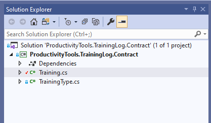

<!--Category:Powershell--> 
 

    
    <a href="http://productivitytools.tech/import-modulesfromdirectory/"><a> 
    

    

# ProductivityTools.TrainingLog.Contract

Project contains objects which can be used to exchange information with [TrainingLog.API](https://github.com/ProductivityTools-TrainingLog/ProductivityTools.TrainingLog.Api). 

It doesn't need to be used, it make it just simpler. 

It contains two objects:
- Training - main object of the application
- Training Type - enum which define type of training 

[AutoDocumentation](ProductivityTools.TrainingLog.Contract.md)

